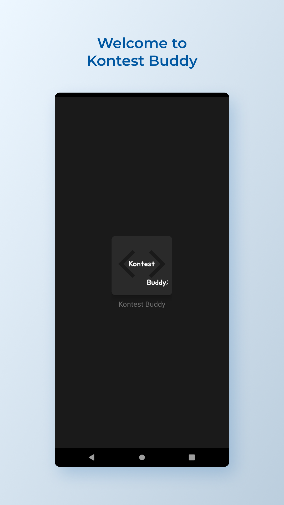
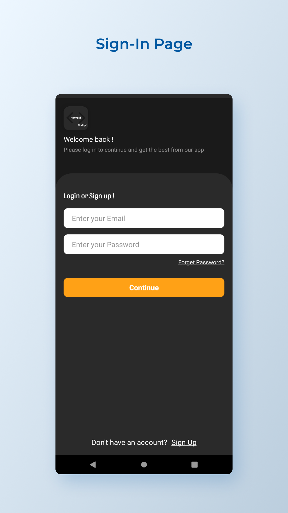
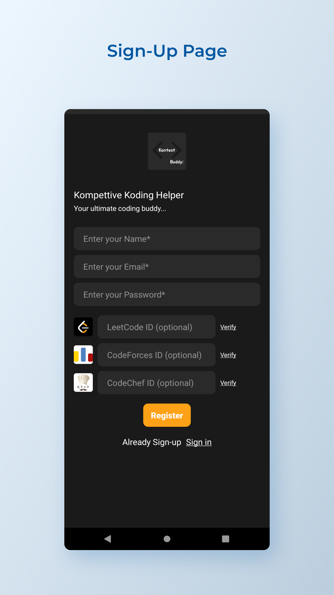
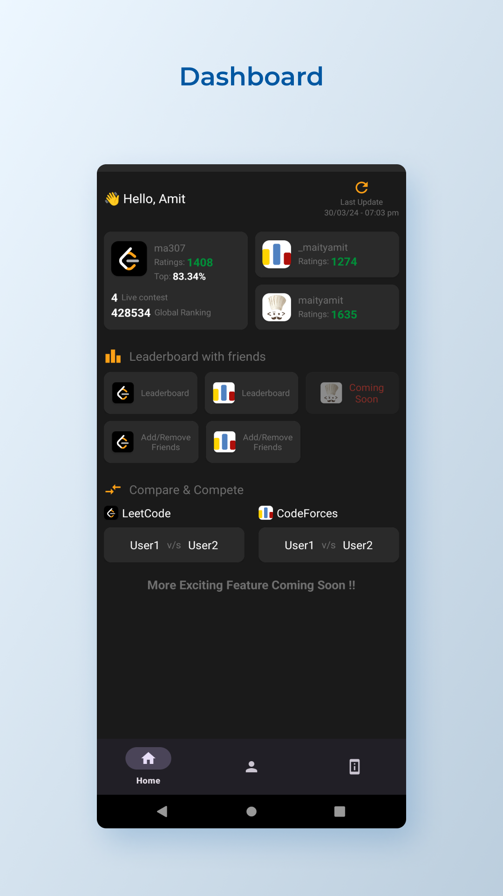
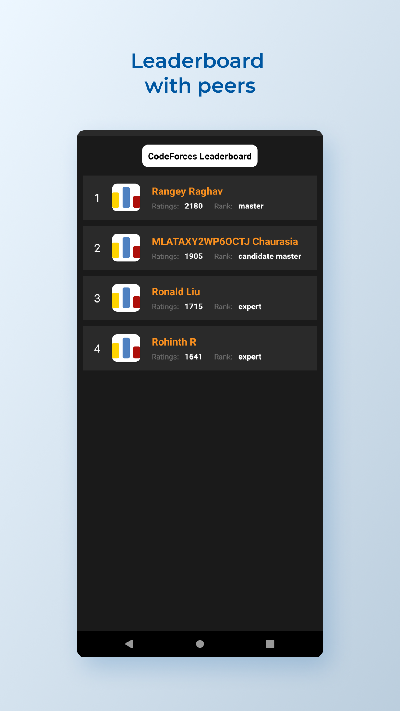
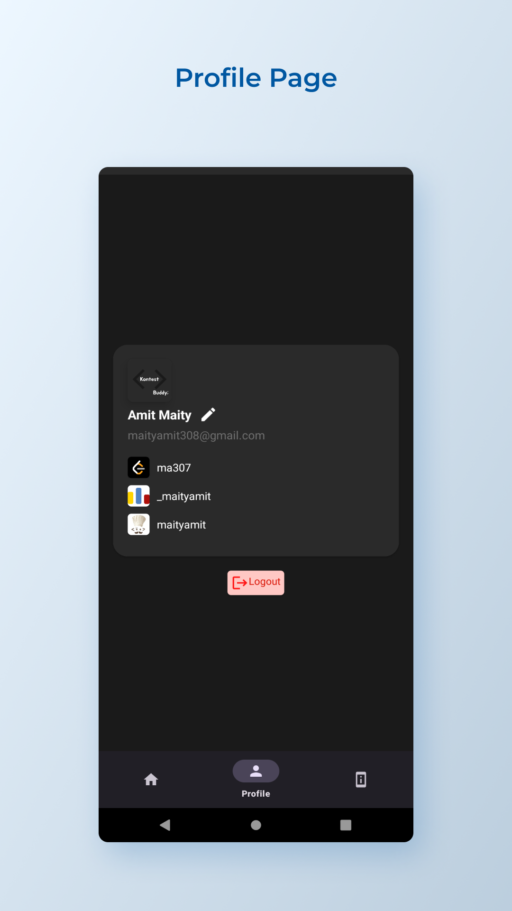

# Kontest Buddy
Compare with your peers and compete !

## 🔗 Download the App [100+ Downloads]

 

 Kontest Buddy
Compare with your peers and compete
Kontest Buddy Application where you can fetch and show you personal ratings and details about LeetCode, CodeForces, and CodeChef accounts. You can see your ratings, rank, etc details.

The main two features of this application are Compare Two Users and Ranking with your peers.

Compare Two Users: You can compare two users of LeetCode or CodeForces and compare between them and compete.

Ranking with your peers: You can add your friends or remove your friends and automatically it will show a leaderboard with your friends.

## 📸 Screenshots

||||
|:----------------------------------------:|:-----------------------------------------:|:-----------------------------------------: |
|  |  |  |
|  |  |  |

 

Amit Maity  
maityamit307@gmail.com
